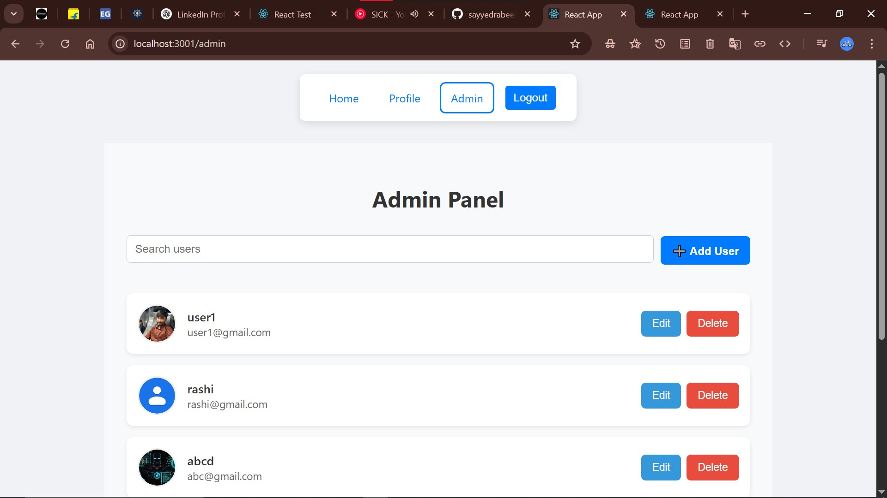

 

 
#   Users Management App

A full-stack user management web application built with **Django REST Framework** and **React + Redux**, supporting JWT authentication, profile management with image upload, and an admin panel for managing users.

---

##   Features

###  Authentication
- Register, Login with JWT
- Secure access tokens and refresh tokens
- Auto login with localStorage

###  User Features
- View and update profile
- Upload profile image
- Protected routes with role-based access

### 🛠 Admin Panel
- View all users
- Edit / Delete users
- Search and filter functionality (in progress)

###   Tech Stack
- **Backend:** Django, Django REST Framework, djoser, SimpleJWT
- **Frontend:** React, Redux Toolkit, Axios, React Router DOM
- **Database:** SQLite (default), can be switched to PostgreSQL
 

---

## 🖥 Project Structure

```

users-managment/
├── backend/               # Django REST API
│   ├── api/               # App with models, views, serializers
│   ├── backend/           # Django project settings
│   └── env/               # Python virtual environment
├── client/                # React frontend
│   └── src/
│       ├── components/    # React components (Admin, User, Common)
│       ├── redux/         # Redux store + slices
│       └── App.js         # Routes and app entry
├── .gitignore
├── README.md
 

````

---

##   Installation

### 1️⃣ Backend Setup (Django)
```bash
cd backend
python -m venv env
env\Scripts\activate      # On Windows
# source env/bin/activate  # On Mac/Linux

pip install -r requirements.txt
python manage.py migrate
python manage.py createsuperuser
python manage.py runserver
````

By default, the server runs at: `http://localhost:8000/`

### 2️⃣ Frontend Setup (React)

```bash
cd client
npm install
npm start
```

React app will run at: `http://localhost:3000/`

---

## 🔐 API Endpoints (Examples)

| Method | Endpoint         | Description            |
| ------ | ---------------- | ---------------------- |
| POST   | `/api/register/` | Register new user      |
| POST   | `/api/login/`    | Login with credentials |
| GET    | `/api/profile/`  | Get user profile       |
| PUT    | `/api/profile/`  | Update profile info    |
| GET    | `/api/users/`    | Admin: list all users  |

> Authenticated requests require `Authorization: Bearer <token>`

---

## 🔄 Branches

* `main` — stable working build
* `full-feature-merge` — includes profile editing, admin panel, image upload, etc.

Merge feature branches with:

```bash
git checkout main
git merge full-feature-merge
```

---

##  Screenshot



---

## 🧑‍💻 Author

👤 [sayyedrabeeh](https://github.com/sayyedrabeeh)
📧 [rabeehsayyed1@gmail.com](mailto:rabeehsayyed1@gmail.com)
📍 India

---

## 📜 License

This project is open-source under the [MIT License](LICENSE).

````

---

 
